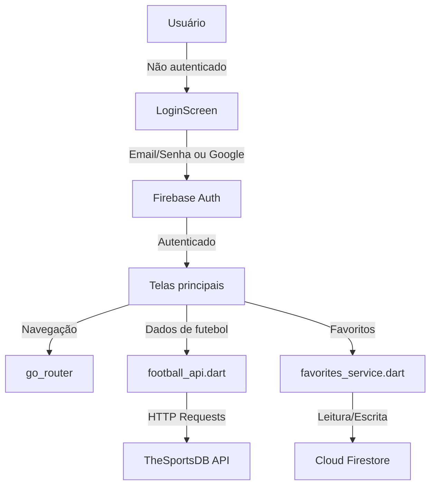

# ⚽ FutVision Mobile

📂 **Repositório no GitHub:**  
👉 https://github.com/EduardoColombari/FutVision_Mobile

📦 **Download do APK:**  
👉 https://github.com/EduardoColombari/FutVision_Mobile/releases/tag/v1.0.0

---

## 📖 Sobre o Projeto

O **FutVision Mobile** é uma aplicação mobile desenvolvida em **Flutter** que permite visualizar, explorar e comparar informações de futebol em tempo real.

A aplicação consome dados de uma API externa de futebol para fornecer informações detalhadas sobre:

- Ligas  
- Times  
- Jogadores  
- Partidas  

O projeto foi criado com foco em **performance, organização de código e experiência do usuário**, utilizando conceitos modernos de desenvolvimento mobile, além de integração com **Firebase** para autenticação e armazenamento de favoritos.

---

## 🚀 Funcionalidades

- 🔐 Autenticação com email/senha e Google (Firebase Auth)  
- ⭐ Salvar times e jogadores favoritos (Cloud Firestore)  
- 🏆 Listagem de ligas e times  
- 📄 Página de detalhes de jogadores e equipes  
- ⚖️ Comparação entre times  
- 📊 Tabelas de classificação  
- 📅 Próximos jogos e partidas  
- 🔄 Navegação com rotas dinâmicas  
- 📱 Interface nativa para Android  

---

## 🛠️ Tecnologias Utilizadas

- 🐦 Flutter  
- 🎯 Dart  
- 🔀 go_router  
- 🌐 http  
- 🖼️ cached_network_image  
- 🔥 Firebase Auth  
- 🗄️ Cloud Firestore  
- 🔑 Google Sign-In  

---

## 🌐 API Utilizada

- ⚽ TheSportsDB API  
  → Utilizada para obter dados de futebol como ligas, times, jogadores e partidas  

---

## 🔥 Integração com Firebase

- **Firebase Authentication** — cadastro e login com email/senha e Google  
- **Cloud Firestore** — armazenamento dos times e jogadores favoritos do usuário  

Estrutura do Firestore:
```
users/
  {uid}/
    favorites/
      team_{id}   → { type, id, name, badge, subtitle, addedAt }
      player_{id} → { type, id, name, badge, subtitle, addedAt }
```

---

## 📦 Como Executar o Projeto

### 1. Clone o repositório

```bash
git clone https://github.com/EduardoColombari/FutVision_Mobile.git
cd FutVision_Mobile
```

### 2. Instale as dependências

Certifique-se de ter o **Flutter SDK** instalado na sua máquina. Em seguida, execute:

```bash
flutter pub get
```

### 3. Rode o app

Conecte um dispositivo Android ou inicie um emulador e execute:

```bash
flutter run
```

### 4. Gerar APK

Para gerar o APK de release:

```bash
flutter build apk --release
```

Os arquivos estarão em: `build/app/outputs/flutter-apk/app-release.apk`

---

## 🤝 Como Contribuir

1. Faça um fork do projeto.  
2. Crie uma nova branch com a sua feature: `git checkout -b minha-feature`.  
3. Commit suas alterações: `git commit -m 'Adicionando nova feature'`.  
4. Envie para a sua branch: `git push origin minha-feature`.  
5. Abra um Pull Request no repositório original.

---

## 📝 Licença

Este projeto está sob a licença **MIT**. Sinta-se à vontade para utilizá-lo e modificá-lo conforme necessário.

---

## 🏗️ Arquitetura da Aplicação

A arquitetura do **FutVision Mobile** segue uma estrutura modular e organizada, utilizando os seguintes conceitos:

- **Telas (`lib/screens`)**: Contém as telas principais da aplicação, como Home, Standings, Matches, Players, Compare, Favorites, About e Login.
- **Widgets (`lib/widgets`)**: Componentes reutilizáveis, como `LeagueCard`, `TeamCard` e `FavoriteButton`.
- **Serviços (`lib/services`)**: Responsável pelas chamadas à API externa e integração com Firebase (`football_api.dart`, `auth_service.dart`, `favorites_service.dart`).
- **Utils (`lib/utils`)**: Funções utilitárias, como traduções de ligas, posições e países.
- **Assets (`assets/`)**: Recursos estáticos como o logo da aplicação.

### Diagrama da Arquitetura



---

## 🗂️ Boas Práticas de Versionamento

O código-fonte do **FutVision Mobile** está versionado no GitHub. Para garantir um bom fluxo de trabalho, siga estas práticas:

- **Commits descritivos**: Use mensagens claras e objetivas, como `git commit -m 'Adiciona tela de favoritos'`.
- **Branches organizadas**: Crie branches específicas para cada feature ou correção, como `feature/firebase-auth`.
- **Pull Requests**: Sempre abra um Pull Request para revisão antes de mesclar alterações na branch principal.

---

## 📊 Informações do Projeto

| Faculdade  | Curso                  | Disciplina          | Autor             |
|------------|------------------------|---------------------|-------------------|
| Uni-FACEF  | Engenharia de Software | Dispositivos Móveis | Eduardo Colombari |
